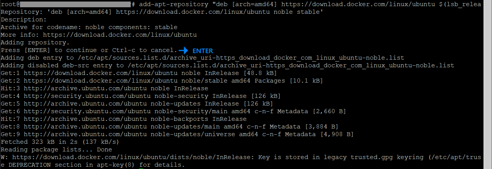
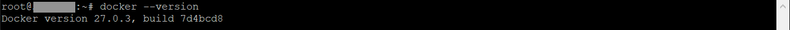
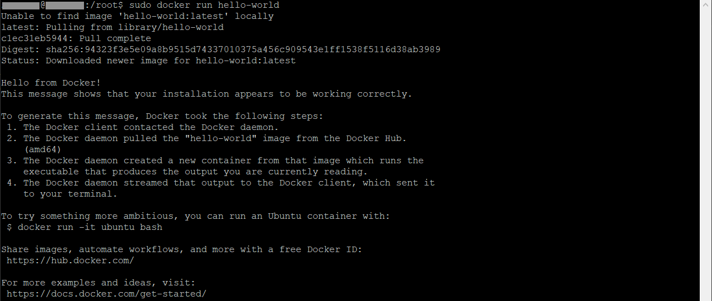

## 0. 기존 Docker 설치 제거 (선택 사항)
- 기존 Docker 가 설치되어 있던 경우 제거방법

```bash
sudo apt-get remove docker docker-engine docker.io containerd runc
```
## 1. 패키지 업데이트
```bash
# 패키지 업데이트
sudo apt-get update
```

## 2. 필요 패키지(종속성) 설치
- HTTPS를 통해 Ubuntu 24.04가 Docker 저장소에 엑세스 할 수 있도록 필요한 패키지를 설치

```bash
# 필요 패키지 설치
sudo apt-get install apt-transport-https ca-certificates curl software-properties-common
```

## 3. Docker 공식 GPG 키 추가
```bash
# Docker 공식 GPG 키 다운로드 | 다운로드 된 GPG키 APT 저장소에 추가
curl -fsSL https://download.docker.com/linux/ubuntu/gpg | sudo apt-key add -

# Docker 공식 GP

# curl option 설명
# -f (fail) : 요청이 실패(400번대 또는 500번대 오류)할 경우 아무런 데이터를 출력하지 않음
# -s (silent) : curl의 출력을 조용하게 만듦 (진행 상황이나 오류 메시지 같은 진단 정보를 표시하지 않음)
# -S (show-error) : silent 옵션과 함께 사용하여, 오류가 발생한 경우 오류 메시지를 표시 (-s 옵션만 사용하면 모든 메시지가 숨겨지지만, -S를 추가하면 오류 메시지는 출력)
# -L (location) : 서버가 리디렉션을 요청할 경우, 자동으로 리디렉션을 따라가도록 함 (ex> 서버가 3xx 상태 코드와 함께 Location 헤더를 반환하면, curl은 그 URL로 자동으로 요청을 보냄)
```

- **참고** : 최근의 APT 버전에서는 apt-key 명령어가 더 이상 사용되지 않는 방향으로 가고 있으며, 대신 키 파일을 별도로 관리하는 방법을 사용하도록 권장하고 있음

```bash
# 키를 별도의 키링에 저장하는 방법
curl -fsSL https://download.docker.com/linux/ubuntu/gpg | sudo gpg --dearmor -o /usr/share/keyrings/docker-archive-keyring.gpg

## gpg --dearmor -o /usr/share/keyrings/docker-archive-keyring.gpg 설명
# gpg --dearmor : ASCII 형식의 GPG 키를 바이너리 형식으로 변환
# -o (output) /usr/share/keyrings/docker-archive-keyring.gpg : 변환된 바이너리 키를 /usr/share/keyrings/docker-archive-keyring.gpg 파일에 저장
```

## 4. Docker APT 저장소 추가
- APT 소스목록에 Docker 저장소를 추가

```bash
add-apt-repository "deb [arch=amd64] https://download.docker.com/linux/ubuntu $(lsb_release -cs) stable"
```



- **참고** : APT 키를 관리하는 더 안전한 방법으로 키를 별도의 키링에 저장

```bash
echo "deb [arch=amd64 signed-by=/usr/share/keyrings/docker-archive-keyring.gpg] https://download.docker.com/linux/ubuntu $(lsb_release -cs) stable" | sudo tee /etc/apt/sources.list.d/docker.list > /dev/null
```

## 5. 패키지 목록 업데이트
- 새로 추가된 Docker 저장소를 사용하기 위해 패키지 목록을 업데이트

```bash
sudo apt-get update
```

## 6. Docker 엔진 & 관련 패키지 설치
```bash
sudo apt-get install docker-ce docker-ce-cli containerd.io
```

## 7. Docker 설치 확인
```bash
sudo docker --version
```



## 8. 도커 실행 확인
```bash
sudo docker run hello-world
```



### 위 명령어는 다음 단계를 수행
- Docker Hub에서 hello-world 이미지를 검색
- 로컬에 해당 이미지가 없으면 Docker Hub에서 이미지를 다운로드
- 다운로드한 이미지를 사용하여 컨테이너를 생성하고 실행

## 루트 권한 없이 Docker 사용 (선택 사항)
```bash
# 현재 사용자를 docker 그룹에 추가
sudo usermod -aG docker $USER

# 변경사항 적용 방법
# 1. 로그아웃 후 다시 로그인
# 2. 다음 명령어 실행
newgrp docker
```

## 설치 완료