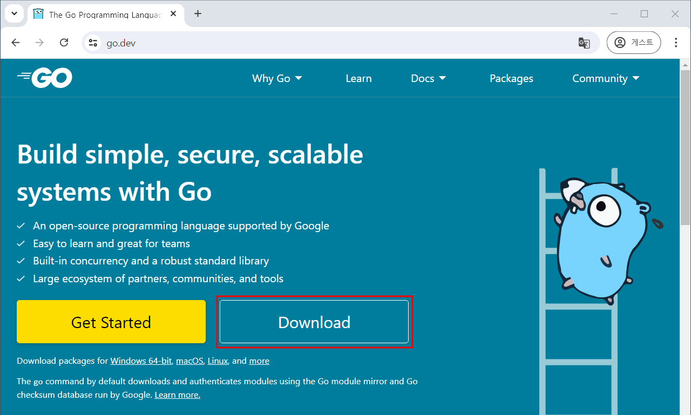
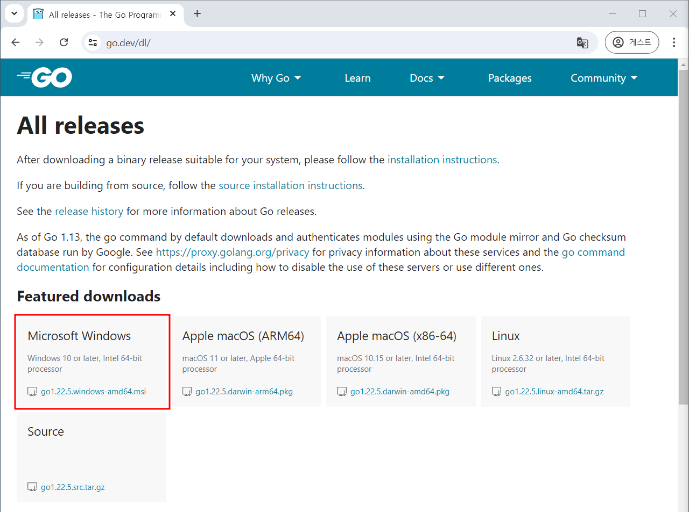
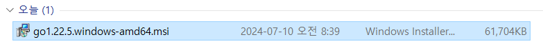
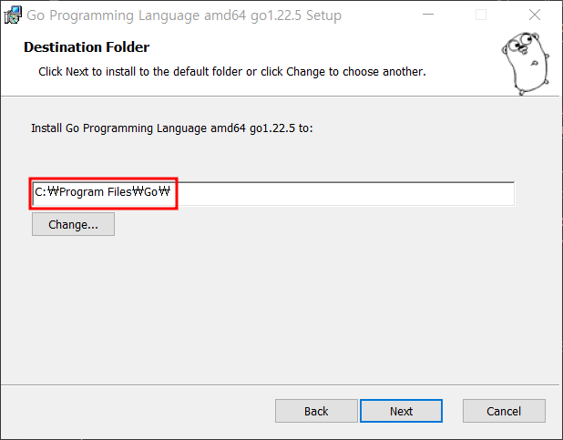
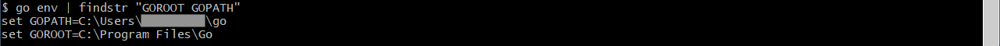
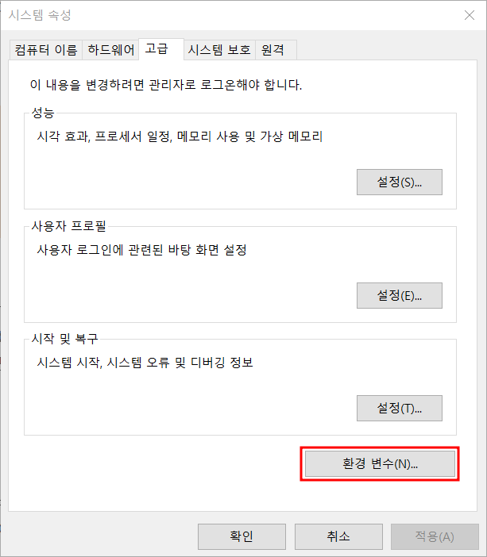
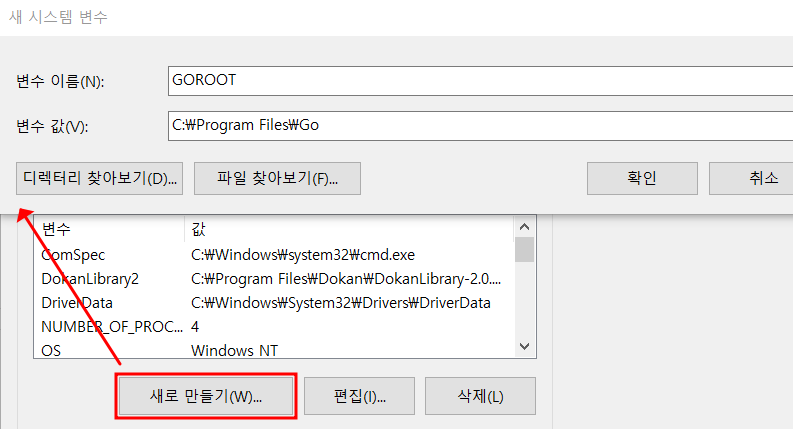
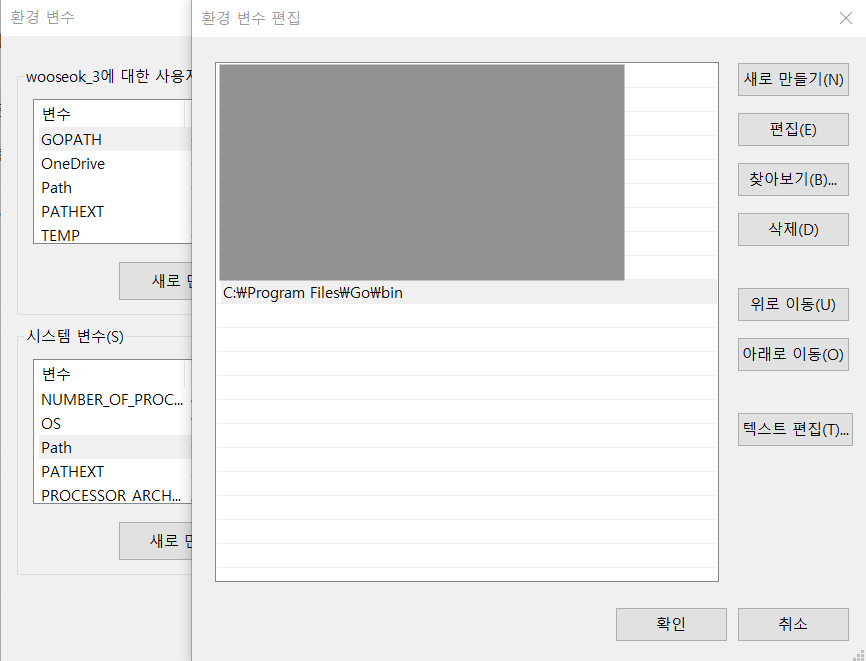

## 1. Go 다운로드
1. [go 공식 홈페이지](https://go.dev/)에 접속하여 Download 클릭

2. Windows 용 설치 프로그램 (.msi 파일)을 다운로드



## 2. Go 설치
1. 다운로드한 `.msi` 파일을 실행

2. 설치 마법사의 지시에 따라 설치 진행 **(환경 변수(GOROOT) 설정 시 설치경로 파악 필요)**


## 3. 환경 변수 설정

### GO 환경변수 설명
```
- GOROOT : Go 설치 디렉토리를 지정하는 환경변수
    - Go 도구 체인은 이 경로를 사용하여 표준 라이브러리와 Go 컴파일러 등 필요한 파일들을 찾음
- GOPATH : Go 프로젝트 소스 코드, 패키지, 그리고 빌드된 바이너리를 저장하는 데 사용
    - src : Go 소스코드가 저장되는 디렉토리
    - pgk : 컴파일된 패키지 오브젝트 파일이 저장되는 디렉토리
    - bin : 컴파일된 실행 파일이 저장되는 디렉토리
```
### 환경 변수 확인
- Go 설치 프로그램은 자동으로 GOROOT와 GOPATH 환경 변수를 설정하지만 확인이 필요할 수 있음 
- 명령 프롬프트(window키+ R)를 열고 `go env` 명령 수행

- **GOROOT 와 GOPATH 환경 변수가 자동으로 등록된 경우 아래의 추가 확인 필요 없음**

### 환경 변수 설정 확인방법
1. Windows 검색에서 "환경 변수"를 입력하고 "시스템 환경 변수 편집"을 선택
2. 시스템 속성 창에서 "환경 변수" 버튼을 클릭

3. 시스템 변수 목록에서 GOROOT와 GOPATH 변수가 설정되어 있는지 확인하고 없는 경우 아래처럼 진행
    - GOPATH : C:\\Users\\[사용자]\\go
    - GOROOT : 2-2 수행 시 진행 했던 설치경로 입력

4. `Path` 환경 변수에 `[Go설치경로]\bin` 이 포함되어있는지 확인하고 만약 없다면 추가



## 4. 설치 확인
- 명령 프롬프트(window키+ R)를 열고 다음 명령어 입력 후 아래의 이미지 처럼 나온다면 설치 성공
```
go version
```


## 5. 간단한 Go 프로그램 실행
```go
package main

import "fmt"

func main() {
	fmt.Println("Golang installation complete!")
}
```

1. 위 예제외 같은 간단한 코드 작성
2. `go run {파일명}.go` 실행
3. `Golang installation complete!` 가 출력된다면 성공

## 6. 설치 완료