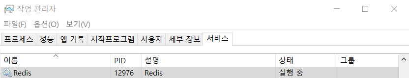
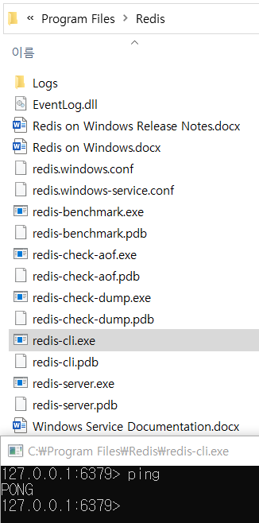

## Redis 란?
- **Re**mote **Di**ctionary **S**erver의 약자로 `키-값` 구조의 비정형 데이터를 저장하고 관리하기 위한 비관계형 데이터베이스 관리 시스템
- 데이터를 디스크에 지속적으로 저장하지 않고 메모리에 보관하여 매우 빠른 읽기 및 쓰기 속도를 제공
- [Single threaded nature of Redis](https://redis.io/docs/latest/operate/oss_and_stack/management/optimization/latency/)

## 데이터 구조 지원
- 주요 데이터 구조
	- String
	- Hash
	- List
	- Set
	- Sorted Set

## 주요 기능
- **캐싱**
    - Redis는 주로 캐시로 사용되어 데이터베이스나 다른 데이터 소스로부터 데이터를 빠르게 읽어오고 메모리에 캐시하여 성능을 향상시킴
- **메시지 브로커**
    - Redis는 Pub/Sub 메시지 브로커 기능을 지원하여 다양한 시스템 간의 메시지 전달을 처리할 수 있음
- **세션 스토어**
    - 세션 정보를 저장하고 관리하는 데 유용하게 사용
- **리더보드**
    - 정렬된 세트를 활용하여 리더보드 기능을 구현할 수 있음
- **통계 및 실시간 데이터 분석**
    - 실시간 데이터 분석이 필요한 경우 Redis의 데이터 구조를 사용하여 통계 및 분석을 수행할 수 있음

## [Golang] Redis Cache 구현

- **참고** : RedisCache 구현체를 작성하기 위해선 Redis 서버에 연결하고, Redis 클라이언트 라이브러리를 사용하여 데이터를 다루는 코드 작업이 필요합니다. ([Redis 설치 바로가기](https://github.com/microsoftarchive/redis/releases))

```golang
package cache

import (
	"context"
	"fmt"
	"time"

	"github.com/redis/go-redis/v9"
)

type RedisCache struct {
	client *redis.Client
}

func NewRedisCache(addr, password string, db int) (*RedisCache, error) {
	client := redis.NewClient(&redis.Options{
		Addr:     addr,
		Password: password, // "" -> no password set
		DB:       db,       // 0 -> use default DB
	})

	_, err := client.Ping(context.Background()).Result()
	if err != nil {
		return nil, fmt.Errorf("failed to connect to Redis: %v", err)
	}

	return &RedisCache{
		client: client,
	}, nil
}

func (c *RedisCache) Get(ctx context.Context, key string) (interface{}, error) {
	val, err := c.client.Get(ctx, key).Result()
	if err == redis.Nil {
		return nil, ErrKeyNotFound
	} else if err != nil {
		return nil, err
	}
	return val, nil
}

func (c *RedisCache) Set(ctx context.Context, key string, value interface{}, ttl time.Duration) error {
	return c.client.Set(ctx, key, value, ttl).Err()
}

func (c *RedisCache) Delete(ctx context.Context, key string) error {
	return c.client.Del(ctx, key).Err()
}

func (c *RedisCache) SetTTL(ctx context.Context, key string, ttl time.Duration) error {
	return c.client.Expire(ctx, key, ttl).Err()

}

func (c *RedisCache) GetTTL(ctx context.Context, key string) (time.Duration, error) {
	ttl, err := c.client.TTL(ctx, key).Result()
	if err != nil {
		return 0, err
	}
	if ttl < 0 {
		return 0, ErrKeyNotFound
	}
	return ttl, nil
}

func (c *RedisCache) Exists(ctx context.Context, key string) (bool, error) {
	// exists ? 1 : 0
	val, err := c.client.Exists(ctx, key).Result()
	if err != nil {
		return false, err
	}
	return val > 0, nil
}

func (c *RedisCache) Clear(ctx context.Context) error {
	return c.client.FlushDB(ctx).Err()
}

// **주의사항**
// close 함수를 호출할 땐 구현체의 재사용 성에 대해 고려해 본 후
// 현재 코드들을 개선하여 사용해야합니다.
// 예를들어, ReOpen() 함수를 개발 하거나,
// 인스턴스를 Close 한 경우 인스턴스를 완전히 소멸 등..
func (c *RedisCache) Close() error {
	return c.client.Close()
}

func (c *RedisCache) Description() string {
	return "RedisCache: A Redis-based cache implementation"
}
```

### 설명
- Redis Cache 구현체는 [go-redis](https://github.com/redis/go-redis) 의 reference에 구현된 함수들을 래핑하였으므로, go-redis 문서를 통하여 구현체의 구체적 기능을 확인

```golang
type RedisCache struct {
	client *redis.Client
}
```
- RedisCache 는 Redis client를 가지며, 생성된 인스턴스의 client를 통해 Redis 서버에 접근
- Redis client 는 여러 고루틴에서 동시에 사용해도 안전하므로 mutex를 별도로 구현하지 않아도 됨

```golang
func NewRedisCache(addr, password string, db int) (*RedisCache, error) {
	client := redis.NewClient(&redis.Options{
		Addr:     addr,
		Password: password, // "" -> no password set
		DB:       db,       // 0 -> use default DB
	})

	_, err := client.Ping(context.Background()).Result()
	if err != nil {
		return nil, fmt.Errorf("failed to connect to Redis: %v", err)
	}

	return &RedisCache{
		client: client,
	}, nil
}
```
- 옵션에 지정한 Redis Server의 클라이언트를 생성하고, Ping 을 통해 Redis 서버의 상태를 확인 (정상 응답 : `PONG`)

```golang
func (c *RedisCache) Get(ctx context.Context, key string) (interface{}, error) {
	val, err := c.client.Get(ctx, key).Result()
	if err == redis.Nil {
		return nil, ErrKeyNotFound
	} else if err != nil {
		return nil, err
	}
	return val, nil
}
```
- 주어진 키에 대한 값을 Redis에서 가져오며, 값이 없다면 `ErrKeyNotFound`를 반환하고, 다른 에러가 발생한다면 에러를 반환

```golang
func (c *RedisCache) Set(ctx context.Context, key string, value interface{}, ttl time.Duration) error {
	return c.client.Set(ctx, key, value, ttl).Err()
}
```
- 주어진 키에 대한 값과 TTL(Time-To-Live)값을 설정하고, Redis에 저장

```golang
func (c *RedisCache) Delete(ctx context.Context, key string) error {
	return c.client.Del(ctx, key).Err()
}
```
- 주어진 키를 삭제

```golang
func (c *RedisCache) SetTTL(ctx context.Context, key string, ttl time.Duration) error {
	return c.client.Expire(ctx, key, ttl).Err()
}
```
- 주어진 키의 TTL 값을 갱신

```golang
func (c *RedisCache) GetTTL(ctx context.Context, key string) (time.Duration, error) {
	ttl, err := c.client.TTL(ctx, key).Result()
	if err != nil {
		return 0, err
	}
	if ttl < 0 {
		return 0, ErrKeyNotFound
	}
	return ttl, nil
}
```
- 주어진 키의 TTL 값을 반환
- 반환값
    - TTL > 0 : `key`의 만료시간이 설정되어 있는 상태
    - TTL == -2 : `key`가 존재하지 않는 상태
    - TTL == -1 : `key`의 만료시간이 설정되어 있지 않은 상태(무한 TTL)
    - TTL == 0 : `error`가 있는 상태
    ```golang
    // 디테일 한 에러 핸들링 가능
    switch {
    case ttl > 0:
        fmt.Printf("The key %s will expire in %v\n", key, ttl)
    case ttl == -2:
        fmt.Printf("The key %s does not exist\n", key)
    case ttl == -1:
        fmt.Printf("The key %s has no expiration\n", key)
    }
    ```

```golang
func (c *RedisCache) Exists(ctx context.Context, key string) (bool, error) {
	val, err := c.client.Exists(ctx, key).Result()
	if err != nil {
		return false, err
	}
	return val > 0, nil
}
```
- 주어진 키가 존재하는지 확인

```golang
func (c *RedisCache) Clear(ctx context.Context) error {
	return c.client.FlushDB(ctx).Err()
}
```
- Redis 데이터베이스를 비움

```golang
func (c *RedisCache) Close() error {
	return c.client.Close()
}
```
- Redis Client 종료

```golang
func (c *RedisCache) Description() string {
	return "RedisCache: A Redis-based cache implementation"
}
```
- 인스턴스의 기본 설명을 문자열로 반환

### 코드 실행 전 확인사항
1. 작업 관리자 실행 후 서비스 탭에서 Redis 실행 중 확인

2. redis 설치경로에 있는 redis-cli 를 이용한 ping/pong 확인 (기본 경로 : `:\Program Files\Redis`)

3. NewRedisCache unit test

```golang
func TestNewRedisCache(t *testing.T) {
	_, err := NewRedisCache("localhost:6379", "", 0)
	if err != nil {
		t.Fatal(err)
	}
	fmt.Println("Redis connection was successful.")
}
```
