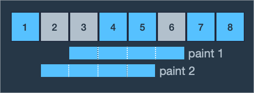
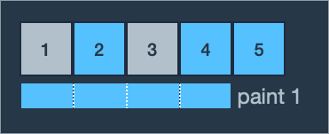
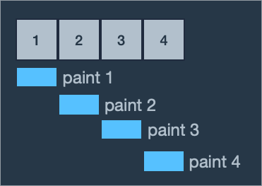

## 문제 설명
어느 학교에 페인트가 칠해진 길이가 `n`미터인 벽이 있습니다. 벽에 동아리 · 학회 홍보나 회사 채용 공고 포스터 등을 게시하기 위해 테이프로 붙였다가 철거할 때 떼는 일이 많고 그 과정에서 페인트가 벗겨지곤 합니다. 페인트가 벗겨진 벽이 보기 흉해져 학교는 벽에 페인트를 덧칠하기로 했습니다.

넓은 벽 전체에 페인트를 새로 칠하는 대신, 구역을 나누어 일부만 페인트를 새로 칠 함으로써 예산을 아끼려 합니다. 이를 위해 벽을 1미터 길이의 구역 `n`개로 나누고, 각 구역에 왼쪽부터 순서대로 1번부터 `n`번까지 번호를 붙였습니다. 그리고 페인트를 다시 칠해야 할 구역들을 정했습니다.

벽에 페인트를 칠하는 롤러의 길이는 `m`미터이고, 롤러로 벽에 페인트를 **한 번** 칠하는 규칙은 다음과 같습니다.

- 롤러가 벽에서 벗어나면 안 됩니다.
- 구역의 일부분만 포함되도록 칠하면 안 됩니다.

즉, 롤러의 좌우측 끝을 구역의 경계선 혹은 벽의 좌우측 끝부분에 맞춘 후 롤러를 위아래로 움직이면서 벽을 칠합니다. 현재 페인트를 칠하는 구역들을 완전히 칠한 후 벽에서 롤러를 떼며, 이를 벽을 **한 번** 칠했다고 정의합니다.

한 구역에 페인트를 여러 번 칠해도 되고 다시 칠해야 할 구역이 아닌 곳에 페인트를 칠해도 되지만 다시 칠하기로 정한 구역은 적어도 한 번 페인트칠을 해야 합니다. 예산을 아끼기 위해 다시 칠할 구역을 정했듯 마찬가지로 롤러로 페인트칠을 하는 횟수를 최소화하려고 합니다.

정수 `n`, `m`과 다시 페인트를 칠하기로 정한 구역들의 번호가 담긴 정수 배열 `section`이 매개변수로 주어질 때 롤러로 페인트칠해야 하는 최소 횟수를 return 하는 solution 함수를 작성해 주세요.

## 제한사항
- 1 ≤ `m` ≤ `n` ≤ 100,000
- 1 ≤ `section`의 길이 ≤ `n`
	- 1 ≤ `section`의 원소 ≤ `n`
	- `section`의 원소는 페인트를 다시 칠해야 하는 구역의 번호입니다.
	- `section`에서 같은 원소가 두 번 이상 나타나지 않습니다.
	- `section`의 원소는 오름차순으로 정렬되어 있습니다.

## 입출력 예

|n|m|section|result|
|-|-|-|-|
|8|4|[2, 3, 6]|2|
|5|4|[1, 3]|1|
|4|1|[1, 2, 3, 4]|4|


## 입출력 예 설명
입출력 예 #1

- 예제 1번은 2, 3, 6번 영역에 페인트를 다시 칠해야 합니다. 롤러의 길이가 4미터이므로 한 번의 페인트칠에 연속된 4개의 구역을 칠할 수 있습니다. 처음에 3, 4, 5, 6번 영역에 페인트칠을 하면 칠해야 할 곳으로 2번 구역만 남고 1, 2, 3, 4번 구역에 페인트칠을 하면 2번 만에 다시 칠해야 할 곳에 모두 페인트칠을 할 수 있습니다.



2번보다 적은 횟수로 2, 3, 6번 영역에 페인트를 덧칠하는 방법은 없습니다. 따라서 최소 횟수인 2를 return 합니다.


입출력 예 #2

- 예제 2번은 1, 3번 영역에 페인트를 다시 칠해야 합니다. 롤러의 길이가 4미터이므로 한 번의 페인트칠에 연속된 4개의 구역을 칠할 수 있고 1, 2, 3, 4번 영역에 페인트칠을 하면 한 번에 1, 3번 영역을 모두 칠할 수 있습니다.



따라서 최소 횟수인 1을 return 합니다.


입출력 예 #3

- 예제 3번은 모든 구역에 페인트칠을 해야 합니다. 롤러의 길이가 1미터이므로 한 번에 한 구역밖에 칠할 수 없습니다. 구역이 4개이므로 각 구역을 한 번씩만 칠하는 4번이 최소 횟수가 됩니다.



따라서 4를 return 합니다.

## 풀이 
```golang
func solution(n int, m int, section []int) int {

	count, position := 0, section[0]

	for _,v := range section {
		if position > v {
			continue
		}
		position = v + m
		count++
	}

	return count
}
```
- 변수 초기화
	- `count` : 롤러로 페인트칠해야 하는 최소 횟수
	- `position`은 현재 위치를 저장하는 변수로, 초기값은 section 배열의 첫 번째 요소
- section 배열 순회
	- 현재포지션과, section 의 값을 비교
		- position 값 이전까진 모두 칠해진 값이므로, position > v 조건의 경우 페인트를 칠 할 필요가 없음
		- 그 외, position = v + m 을 하여 다음 칠해야 할 포지션 위치로 이동 및 페인트 칠 카운트 증가

## 테스트코드
### 유닛 테스트
```golang
func TestSolution(t *testing.T) {
	nTestCases := []int{8, 5, 4}
	mTestCases := []int{4, 4, 1}
	sectionTestCases := [][]int{
		{2, 3, 6},
		{1, 3},
		{1, 2, 3, 4},
	}
	successResult := []int{2, 1, 4}

	for i := 0; i < 3; i++ {
		v := solution(nTestCases[i], mTestCases[i], sectionTestCases[i])
		if v == successResult[i] {
			fmt.Printf("%d test success\n", i+1)
			continue
		}
		t.Fatalf("%d test failure\n", i+1)
	}
}
```

```bash
$ go test -v
=== RUN   TestSolution
1 test success
2 test success
3 test success
--- PASS: TestSolution (0.00s)
PASS
ok      golang-coding-test/Lv1/over_painting    0.306s
```

## [Github 바로가기](https://github.com/kr-goos/golang-coding-test/tree/master/Lv1/over_painting)