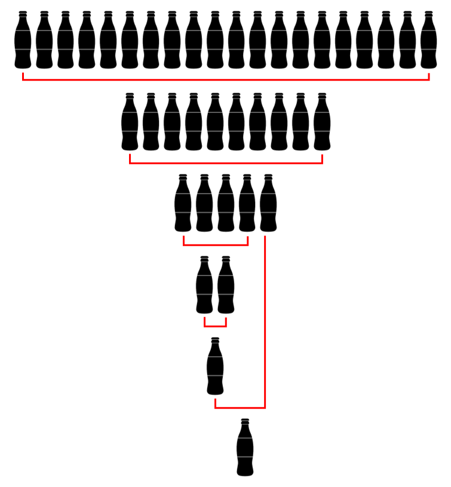

## 문제 설명
오래전 유행했던 콜라 문제가 있습니다. 콜라 문제의 지문은 다음과 같습니다.

정답은 아무에게도 말하지 마세요.

콜라 빈 병 2개를 가져다주면 콜라 1병을 주는 마트가 있다. 빈 병 20개를 가져다주면 몇 병을 받을 수 있는가?

단, 보유 중인 빈 병이 2개 미만이면, 콜라를 받을 수 없다.

문제를 풀던 상빈이는 콜라 문제의 완벽한 해답을 찾았습니다. 상빈이가 푼 방법은 아래 그림과 같습니다. 우선 콜라 빈 병 20병을 가져가서 10병을 받습니다. 받은 10병을 모두 마신 뒤, 가져가서 5병을 받습니다. 5병 중 4병을 모두 마신 뒤 가져가서 2병을 받고, 또 2병을 모두 마신 뒤 가져가서 1병을 받습니다. 받은 1병과 5병을 받았을 때 남은 1병을 모두 마신 뒤 가져가면 1병을 또 받을 수 있습니다. 이 경우 상빈이는 총 10 + 5 + 2 + 1 + 1 = 19병의 콜라를 받을 수 있습니다.



문제를 열심히 풀던 상빈이는 일반화된 콜라 문제를 생각했습니다. 이 문제는 빈 병 `a`개를 가져다주면 콜라 `b`병을 주는 마트가 있을 때, 빈 병 `n`개를 가져다주면 몇 병을 받을 수 있는지 계산하는 문제입니다. 기존 콜라 문제와 마찬가지로, 보유 중인 빈 병이 `a`개 미만이면, 추가적으로 빈 병을 받을 순 없습니다. 상빈이는 열심히 고심했지만, 일반화된 콜라 문제의 답을 찾을 수 없었습니다. 상빈이를 도와, 일반화된 콜라 문제를 해결하는 프로그램을 만들어 주세요.

콜라를 받기 위해 마트에 주어야 하는 병 수 `a`, 빈 병 `a`개를 가져다 주면 마트가 주는 콜라 병 수 `b`, 상빈이가 가지고 있는 빈 병의 개수 n이 매개변수로 주어집니다. 상빈이가 받을 수 있는 콜라의 병 수를 return 하도록 solution 함수를 작성해주세요.


## 제한사항
- 1 ≤ `b` < `a` ≤ `n` ≤ 1,000,000
- 정답은 항상 int 범위를 넘지 않게 주어집니다.


## 입출력 예

| a | b | n | result |
| --- | --- | --- | --- |
| 2 | 1 | 20 | 19 |
| 3 | 1 | 20 | 9 |



## 입출력 예 설명
**입출력 예 #1**

- 본문에서 설명한 예시입니다.

**입출력 예 #2**

- 빈 병 20개 중 18개를 마트에 가져가서, 6병의 콜라를 받습니다. 이때 상빈이가 가지고 있는 콜라 병의 수는 8(20 – 18 + 6 = 8)개 입니다.
- 빈 병 8개 중 6개를 마트에 가져가서, 2병의 콜라를 받습니다. 이때 상빈이가 가지고 있는 콜라 병의 수는 4(8 – 6 + 2 = 4)개 입니다.
- 빈 병 4 개중 3개를 마트에 가져가서, 1병의 콜라를 받습니다. 이때 상빈이가 가지고 있는 콜라 병의 수는 2(4 – 3 + 1 = 2)개 입니다.
- 3번의 교환 동안 상빈이는 9(6 + 2 + 1 = 9)병의 콜라를 받았습니다.


## 풀이 
```golang
func solution(a int, b int, n int) int {
	var count int
	for n >= a {
		returnedCoke := n / a * b
		remainedCoke := n % a

		n = remainedCoke + returnedCoke
		count += returnedCoke
	}

	return count
}
```
- `returnedCoke` : 교환할 수 있는 콜라의 개수
- `remainedCoke` : 교환 후 남은 빈 병의 개수
- `count` : 받은 총 콜라의 개수
- `n >= a` 일 때 순회하며 `n` 은 교환할 수 있는 콜라의 개수 + 교환 후 남은 빈 병의 개수 로 계산


## 테스트코드
### 유닛 테스트
```golang
const TESTCOUNT = 2

var (
	a      = [TESTCOUNT]int{2, 3}
	b      = [TESTCOUNT]int{1, 1}
	n      = [TESTCOUNT]int{20, 20}
	result = [TESTCOUNT]int{19, 9}
)

func TestSolution(t *testing.T) {

	for i := 0; i < TESTCOUNT; i++ {
		fmt.Println("a[i] : ", a[i])
		fmt.Println("b[i] : ", b[i])
		fmt.Println("n[i] : ", n[i])
		fmt.Println("result[i] : ", result[i])
		fmt.Println("my solution result : ", solution(a[i], b[i], n[i]))
	}
}
```

```bash
$ go test -v
=== RUN   TestSolution
a[i] :  2
b[i] :  1
n[i] :  20
result[i] :  19
my solution result :  19
a[i] :  3
b[i] :  1
n[i] :  20
result[i] :  9
my solution result :  9
--- PASS: TestSolution (0.03s)
PASS
ok      golang-coding-test/Lv1/coke     0.382s
```

## [Github 바로가기](https://github.com/kr-goos/golang-coding-test/tree/master/Lv1/coke)