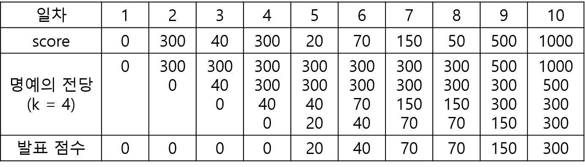

## 문제 설명
"명예의 전당"이라는 TV 프로그램에서는 매일 1명의 가수가 노래를 부르고, 시청자들의 문자 투표수로 가수에게 점수를 부여합니다. 매일 출연한 가수의 점수가 지금까지 출연 가수들의 점수 중 상위 k번째 이내이면 해당 가수의 점수를 명예의 전당이라는 목록에 올려 기념합니다. 즉 프로그램 시작 이후 초기에 k일까지는 모든 출연 가수의 점수가 명예의 전당에 오르게 됩니다. k일 다음부터는 출연 가수의 점수가 기존의 명예의 전당 목록의 k번째 순위의 가수 점수보다 더 높으면, 출연 가수의 점수가 명예의 전당에 오르게 되고 기존의 k번째 순위의 점수는 명예의 전당에서 내려오게 됩니다.

이 프로그램에서는 매일 "명예의 전당"의 최하위 점수를 발표합니다. 예를 들어, `k` = 3이고, 7일 동안 진행된 가수의 점수가 [10, 100, 20, 150, 1, 100, 200]이라면, 명예의 전당에서 발표된 점수는 아래의 그림과 같이 [10, 10, 10, 20, 20, 100, 100]입니다.


명예의 전당 목록의 점수의 개수 `k`, 1일부터 마지막 날까지 출연한 가수들의 점수인 `score`가 주어졌을 때, 매일 발표된 명예의 전당의 최하위 점수를 return하는 solution 함수를 완성해주세요.

## 제한사항
- 3 ≤ `k` ≤ 100
- 7 ≤ `score`의 길이 ≤ 1,000
	- 0 ≤ `score[i]` ≤ 2,000

## 입출력 예

| k | score | result |
| --- | --- | --- |
| 3 | \[10, 100, 20, 150, 1, 100, 200\] | \[10, 10, 10, 20, 20, 100, 100\] |
| 4 | \[0, 300, 40, 300, 20, 70, 150, 50, 500, 1000\] | \[0, 0, 0, 0, 20, 40, 70, 70, 150, 300\] |


## 입출력 예 설명
**입출력 예 #1**

- 문제의 예시와 같습니다.

**입출력 예 #2**

- 아래와 같이, [0, 0, 0, 0, 20, 40, 70, 70, 150, 300]을 return합니다.




## 풀이 
```golang
func solution(k int, score []int) []int {

	hallOfFame := make([]int, 0, k+1)
	result := make([]int, len(score))
	for i, s := range score {
		hallOfFame = append(hallOfFame, s)
		sort.Ints(hallOfFame)

		if len(hallOfFame) > k {
			hallOfFame = hallOfFame[1:]
		}
		result[i] = hallOfFame[0]
	}

	return result
}
```
- 초기화
	- `hallOfFame` 리스트를 초기화 (명예의 전당 리스트)
		- cap 가 `k + 1` 인 이유 : `k` 일 이후의 값을 포함하여 저장하고 정렬한 후 슬라이싱 하기 위함
	- `result` 리스트를 초기화하여 매일 발표된 명예의 전당의 최하위 점수를 저장
- 점수 처리
	- `score` 리스트를 순회하며 각 가수의 점수 `s` 를 `hallOfFame`리스트에 저장 (k일 이후의 len, cap 은 k+1 까지 될 수 있음)
	- `hallOfFame` 리스트에 현재 점수를 추가
	- `hallOfFame` 리스트를 오름차순으로 정렬
	- `hallOfFame` 리스트의 길이가 k를 초과하면, 가장 낮은 점수를 제거하여 리스트의 길이를 k로 유지
- 최하위 점수 `result` 에 저장


## 테스트코드
### 유닛 테스트
```golang
func TestSolution(t *testing.T) {
	const TESTCOUNT = 2
	k := [TESTCOUNT]int{3, 4}
	score := [TESTCOUNT][]int{
		{10, 100, 20, 150, 1, 100, 200},
		{0, 300, 40, 300, 20, 70, 150, 50, 500, 1000},
	}
	result := [TESTCOUNT][]int{
		{10, 10, 10, 20, 20, 100, 100},
		{0, 0, 0, 0, 20, 40, 70, 70, 150, 300},
	}

	for i := 0; i < TESTCOUNT; i++ {
		fmt.Println("k : ", k[i])
		fmt.Println("score :", score[i])
		fmt.Println("succree result : ", result[i])
		fmt.Println("my solution result : ", solution(k[i], score[i]))
	}

}
```

```bash
$ go test -v
=== RUN   TestSolution
k :  3
score : [10 100 20 150 1 100 200]
succree result :  [10 10 10 20 20 100 100]
my solution result :  [10 10 10 20 20 100 100]
k :  4
score : [0 300 40 300 20 70 150 50 500 1000]
succree result :  [0 0 0 0 20 40 70 70 150 300]
my solution result :  [0 0 0 0 20 40 70 70 150 300]
--- PASS: TestSolution (0.01s)
PASS
ok      golang-coding-test/Lv1/hall_of_fame_1   0.145s
```

## [Github 바로가기](https://github.com/kr-goos/golang-coding-test/tree/master/programmers/Lv1/hall_of_fame_1)