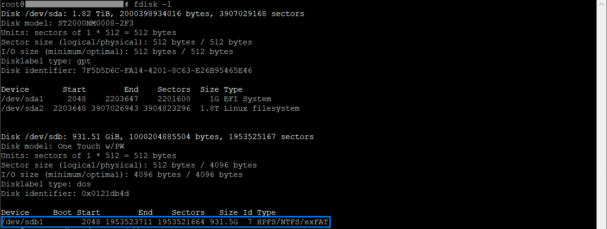
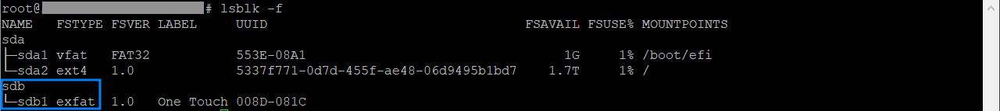
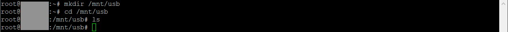
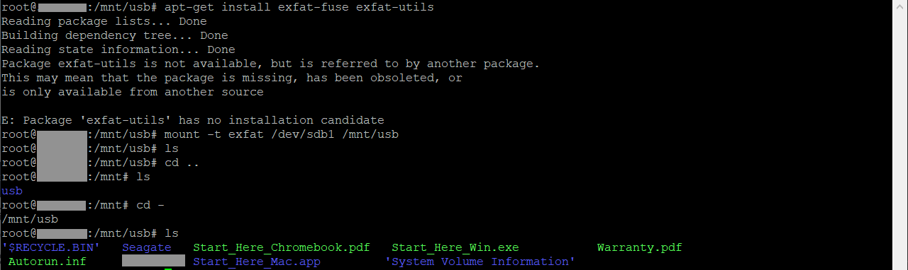

## 0. USB 삽입

## 1. USB 드라이브 확인
```bash
fdisk -l

# fdisk : 리눅스 시스템에서 모든 디스크 파티션 테이블을 표시
# -l : "list"의 약자로, 시스템에 연결된 모든 디스크의 파티션 테이블을 나열하는 것을 의미
```



### USB 디스크 식별 방법
1. 디스크 크기 : USB 의 크기를 사전에 식별하고 확인 
2. 디스크 이름 : USB 드라이브는 보통 sda, sdb, sdc와 같은 이름으로 표시됩니다. 새로 연결된 디스크는 순차적으로 이름이 지정됩니다. 
    - 예를들어 위 사진과 같이 기존 디스크가 /dev/sd**a** 인 경우, 새로운 USB 드라이브는 /dev/sd**b**로 표시
3. USB 삽입 전 fdisk -l 와 삽입 후 fdisk -l 명령의 차이로 확인
4. 디스크 모델 및 제조사 : fdisk -l 명령어 출력에는 디스크 모델과 제조사 정보가 포함될 수 있음


## 1-a. 파일 시스템 유형 확인
- `fdisk -l` 의 타입 컬럼을 통해 타입을 확인할 수 있지만, 필자의 경우 HPFS/NTFS/exFAT 처럼 여러 개의 타입이 확인되어 아래의 명령으로 시스템 유형 확인

```bash
lsblk -f

# lsblk : 시스템에 연결된 모든 블록 장치를 나열하는 명령어
# -f : 파일 시스템 유형 및 관련 정보를 포함하여 출력을 표시
```



## 2. 마운트 포인트 생성
- USB 드라이브를 마운트할 디렉토리를 생성

```bash
sudo mkdir -p /mnt/usb

# mkdir : "make directory"의 줄임말로, 새로운 디렉토리(폴더)를 생성하는 명령어
# -p (parents) : 디렉토리를 생성하기 위해 필요한 모든 중간 디렉토리도 함께 생성
```


- **TMI** : /mnt 디렉토리는 일반적으로 리눅스 시스템에서 임시로 마운트할 디렉토리를 관리하는 데 사용되며, usb 디렉토리는 여기서 특정 USB 장치를 마운트할 디렉토리를 의미


## 3. 파일 시스템 마운트

```bash
# mount 명령어 설명
#
# sudo mount -t [파일시스템-타입] [partition | UUID] [mount-point]
#
# mount : 파일 시스템을 특정 디렉토리에 연결
# -t (type) : 마운트할 파일 시스템의 종류를 명시적으로 지정
# [partition | UUID] : 마운트할 장치 또는 파일의 경로를 지정
# [mount-point] : 2번 에서 생성한 마운트 포인트 지정

# NTFS 파일시스템
sudo mount -t ntfs-3g /dev/sdb1 /mnt/usb

# exFAT 파일 시스템
# exFAT 파일 시스템을 마운트하려면 exfat-fuse 및 exfat-utils 패키지가 필요
sudo apt-get install exfat-fuse exfat-utils
sudo mount -t exfat /dev/sdb1 /mnt/usb

# FAT32 파일 시스템
sudo mount -t vfat /dev/sdb1 /mnt/usb
```



- **주의사항** : mount 대상 경로에서 mount 명령을 수행하고, ls 명령어를 실행했을 때 아래와 같이 아무것도 보이지 않습니다. mount 대상 경로에서 mount 명령을 실행 한 경우 다른 디렉토리로 이동 후 다시 조회해 봅니다.


## 4. 마운트 경로에 작업 수행
```bash
# mount-point를 대상으로 작업 수행
#
# 작업 예시
cp -r /path/to/source/files /mnt/usb
mv -r /etc/apt/sources.list /mnt/usb
```

## 5. 마운트 해제
```bash
# 4번 작업 완료 후 마운트 해제
sudo umount /mnt/usb
```

## 6. USB 제거