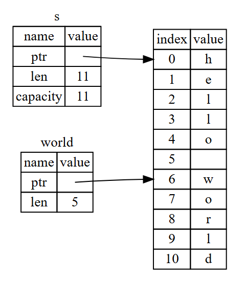

소유권은 러스트가 가비지 컬렉터 없이 메모리 안정성을 보장하도록 해주므로, 소유권이 어떻게 작동하는지를 이해하는 것이 중요합니다.

## 소유권이 뭔가요?
**소유권(ownership)** 은 러스트 프로그램의 메모리 관리법을 지배하는 규칙 모음입니다. 모든 프로그램은 작동하는 동안 컴퓨터의 메모리 사용 방법을 관리해야 합니다.
러스트에서는 소유권 이라는 시스템을 이용하여 컴파일러가 컴파일 중에 검사할 여러 규칙을 정해 메모리를 관리하는 방식사용하고, 이 규칙 중 하나라도 위반하면 프로그램은 컴파일 되지 않습니다.

### 소유권 규칙
- 러스트에서, 각각의 값은 **소유자(owner)**가 정해져 있습니다.
- 한 값의 소유자는 동시에 여럿 존재할 수 없습니다.
- 소유자가 스코프 밖으로 벗어날 때, 값은 버려집니다(dropped).

### 변수의 스코프
스코프란, 프로그램 내에서 아이템이 **유효한 범위** 를 말합니다.

```rust
{                       // s는 아직 선언되지 않아서 유효하지 않음
    let s = "hello";    // 이 지점부터 s 가 유효
    ...                 // s 유효
}                       // 스코프 종료로, s가 더이상 유효하지 않음
```
- s가 스코프 내에 나타나면 유효합니다.
- 유효 기간(생명주기)은 스코프 밖으로 벗어나기 전까지입니다.


### 메모리와 할당
문자열 리터럴은 컴파일 타임에 내용을 알 수 있어 텍스트가 최종 실행 파일에 하드코딩 됩니다. 이 방식은 빠르고 효율적이지만, 문자열이 변하지 않을 경우에만 사용할 수 있습니다. 반면, String 타입은 힙에 메모리를 할당하는 방식을 사용하기 때문에 텍스트 내용 및 크기를 변경할 수 있습니다. 이는 다음을 의미하기도 합니다.

- 실행 중 메모리 할당자로부터 메모리를 요청해야 합니다.
- String 사용을 마쳤을 때 메모리를 해제할(즉, 할당자에게 메모리를 반납할) 방법이 필요합니다.

이 중 첫 번째는 `String::from` 호출로, 필요한 메모리를 요청하도록 구현되어있습니다.
두 번 째는, **가비지 컬렉터(garbage collector, GC)** 를 갖는 언어에서는 GC가 사용하지 않는 메모리를 찾아 없애주지만, GC가 없는 언어에서는 할당받은 **메모리가 필요 없어지는 지점을 프로그래머가 직접 찾아 메모리 해제 코드를 작성**해야합니다. 이는 아래와 같은 문제들을 야기할 수 있습니다.

- 프로그래머가 놓친 부분이 있다면 메모리 낭비가 발생함
- 메모리 해제 시점을 너무 일찍 잡으면 유효하지 않은 변수가 생김
- 두 번 해제할 경우도 마찬가지로 버그가 발생

러스트는 이 문제를 변수가 자신이 소속된 스코프를 벗어나는 순간 자동으로 메모리를 해제하는 방식으로 해결

```rust
{
    let s = String::from("hello"); // s는 이 지점부터 유효
                                   // s 를 가지고 무언가를 함
}                                  // 스코프가 종료되었고, s는 더이상 유효하지 않음
```

- `s`가 스코프 밖으로 벗어나면, `String` 에서 사용한 메모리를 자연스럽게 해제합니다.
    - 러스트는 변수가 스코프 밖으로 벗어나면 `drop` 이라는 특별한 함수를 호출합니다. (즉, 닫힌 중괄호(`}`)가 나타나는 지점에서 자동으로 호출)
    - `drop`은 해당 타입을 개발한 개발자가 직접 메모리 해제 코드를 작성해 넣을 수 있게 되어있습니다.


#### 변수와 데이터 간 상호작용 방식:이동

**Copy(복사)**
```rust
let x = 5;
let y = x;
```
- 값이 **스택(stack)**에 바로 저장되는 단순한 타입들은 그냥 값을 복사해서 새 변수에 바인딩합니다.
    - `5`를 `x`에 바인딩하세요.
    - `x`값의 복사본을 만들어 `y`에 바인딩하세요.
    - 따라서 두 `5`값은 스택에 푸시됩니다.

**Move(이동)**
```rust
let s1 = String::from("hello");
let s2 = s1;
```
- 값이 **힙(heap)**에 있는 데이터를 가리키는 타입들은 새 변수에 대입하면 데이터를 **복사하지 않고**, 원래 변수가 가지고 있던 **소유권**을 그대로 넘겨줍니다.
- `let s1 = String::from("hello");`
    - 스택(stack)
        - s1
            |이름|값|
            |-|-|
            |포인터|힙에 저장된 "hello" 문자열 데이터의 시작 주소|
            |길이|5|
            |용량|5|
    - 힙(Heap)
        - |인덱스|값|
          |-|-|
          |0|h|
          |1|e|
          |2|l|
          |3|l|
          |4|o|
- `let s2 = s1;`
    - `s2` 에 `s1` 을 대입하면 String 데이터(Stack 의 값)가 복사됩니다.
        - s2
            |이름|값|
            |-|-|
            |포인터|힙에 저장된 "hello" 문자열 데이터의 시작 주소|
            |길이|5|
            |용량|5|
    - Rust 는 **소유권(ownership)**을 `s1`에서 `s2`로 **이동**시킵니다.
        - `s1` 은 더이상 사용할 수 없게 됩니다. (유효하지 않은 참조자의 사용을 감지했다는 에러 발생)
            - 만약 `s1`와 `s2` 의 포인터가 모두 같은 Heap 을 바라보고 있다면 `s1`, `s2`가 스코프 밖으로 벗어날 때 각각 메모리를 해제하게 되면 **중복해제(double free)** 에러가 발생할 것입니다.따라서 러스트는 **메모리 안정성을 보장**하기 위해 let s2 = s1; 라인 뒤로는 더이상 s1이 **유효하지 않다고 판단**합니다.
    - 위 과정을 거쳐 `s1`이 `s2`로 **이동되었다** 라고 표현합니다.
    - 


#### 변수와 데이터 간 상호작용 방식:클론
String의 힙 데이터까지 깊이 복사하고 싶을 경우 `clone` 이라는 공용 메서드를 사용할 수 있습니다. `clone` 은 **깊은 복사(Deep Copy)** 를 수행하여 힙 데이터까지 복사하는 동작을 수행합니다.

```rust
let s1 = String::from("hello");
let s2 = s1.clone();
```

#### 스택에만 저장되는 데이터:복사
정수형 등 컴파일 타임에 크기가 고정되는 타입은 모두 스택에 저장되기 때문에, 복사본을 빠르게 만들 수 있고, 따라서 굳이 새 변수를 사용할 때 기존 변수를 무효화 할 필요가 없습니다. 즉, 깊은 복사와 얕은 복사 간에 차이가 없습니다.

- Copy 가능한 타입
    - 모든 정수형 타입
    - true, false값을 갖는 논리 자료형 bool
    - 모든 부동소수점 타입
    - 문자 타입 char
    - Copy 가능한 타입만으로 구성된 튜플(예를들어, (i32,i32)는 Copy 가능하지만 (i32, String)은 불가능)

### 소유권과 함수

```rust
fn main() {
    let s = String::from("hello");  // s가 스코프 안으로 들어옵니다.

    takes_ownership(s);             // s의 값이 함수로 이동됩니다.
                                    // 따라서 여기서는 더이상 유효하지 않습니다.

    let x = 5;                      // x가 스코프 안으로 들어옵니다.

    makes_copy(x);                  // x가 함수로 이동됩니다. 하지만,
                                    // i32는 Copy이므로 앞으로 계속 x를 사용해도 좋습니다.
}   // 여기서 x가 스코프 밖으로 벗어나고 s도 그렇게 됩니다. 그러나 s의 값이 이동되었으므로
    // 별다른 일이 발생하지 않습니다.

fn takes_ownership(some_string: String) {   // some_string이 스코프 안으로 들어옵니다.
    println!("{}",some_string);
}   // 여기서 some_string이 스코프 밖으로 벗어나고 `drop`이 호출됩니다.
    // 메모리가 해제됩니다.

fn makes_copy(some_integer: i32) {          // some_integer가 스코프 안으로 들어옵니다.
    println!("{}",some_integer);
}   // 여기서 some_integer가 스코프 밖으로 벗어납니다. 별다른 일이 발생하지 않습니다.
```
- `takes_ownership`함수를 호출한 이후 `s`를 사용하려 할 경우, 컴파일 타임 에러가 발생됩니다.
    - 이와같이 변수 사용하는 코드를 여기 저기 집어 넣어, 어느 지점에서 변수를 사용할 수 있고 어느 지점에서 소유권 규칙이 제재하는지 확인해볼 수 있다.


### 반환값과 스코프

```rust
fn main() {
    let s1 = gives_ownership();                 // gives_ownership이 자신의 반환값을 s1로 이동시킵니다

    let s2 = String::from("hello");             // s2가 스코프 안으로 들어옵니다.

    let s3 = takes_and_gives_back(s2);          // s2는 takes_and_gives_back으로 이동되는데,
                                                // 이 함수 또한 자신의 반환값을 s3으로 이동시킵니다.
}   // 여기서 s3가 스코프 밖으로 벗어나면서 버려집니다. s2는 이동되어서 아무 일도 일어나지 않습니다.
    // s1은 스코프 밖으로 벗어나고 버려집니다.

fn gives_ownership() -> String {                // gives_ownership은 자신의 반환값을 
                                                // 자신의 호출자 함수로 이동시킬 것입니다.

    let some_string = String::from("yours");    // some_string이 스코프 안으로 들어옵니다.

    some_string                                 // some_string이 반환되고, 호출자 함수 쪽으로 이동합니다.

}


fn takes_and_gives_back(a_string: String) -> String {   // a_string이 스코프 안으로 들어옵니다.
    a_string // a_string 이 반환되고 호출자 함수 쪽으로 이동합니다.
}
```

- 상황은 다양할지라도, 변수의 소유권 규칙은 언제나 동일합니다.
    - 어떤 값을 다른 변수에 대입하면 값이 이동하고, 힙에 데이터를 갖는 변수가 스코프를 벗어나면, 사전에 해당 데이터가 이동하여 소유권이 다른 변수에 이동되지 않은 이상 drop에 의해 데이터가 제거됩니다.


## 참조와 대여
**참조자(reference)** 는 해당 주소에 저장된 데이터에 접근할 수 잇도록 해주는 주솟값에 해당하는, 포인터와 같은 것입니다. 
그 데이터는 어떤 변수가 소유하고 있으며, 포인터와 달리 참조자는 살아있는 동안 특정 타입에 대한 유효한 값을 가리킴을 보장해줍니다.


**매개변수의 소유권을 되돌려주는 방법**
```rust
fn main() {
    let s1 = String::from("hello");
    let (s2, len) = calculate_length(s1);

    println!("The length of '{}' is {}.", s2, len);
}

fn calculate_length(s: String) -> (String, usize) {
    let length = s.len(); // len()은 String의 길이를 반환합니다.

    (s, length)
}
```

**참조자를 매개변수로 받도록 구현한 방법**
```rust
fn main() {
    let s1 = String::from("hello");
    let len = calculate_length(&s1);

    println!("The length of '{}' is {}.", s1, len);
}

fn calculate_length(s: &String) -> usize { // s 는 String의 참조자입니다.
    s.len()
} // 여기서 s가 스코프 밖으로 벗어나지만, 참조하는 것을 소유하고 있진 않으므로 버려지지는 않습니다.
```

- 변수 선언부와 함수 반환값에 위치하던 튜플 코드가 전부 사라진 것을 볼 수 있습니다.
- `calculate_length` 함수에 `s1` 대신 `&s1`을 전달 하고 함수 시그니처에 `&String`을 사용했습니다.
    - 여기서 사용한 앰퍼샌드(`&`) 기호가 참조자를 나타냅니다.
    - 참조자는 어떤 값의 소유권을 가져오지 않고 해당 값을 참조할 수 있도록 해줍니다.
    - 
- `s1`에 &를 붙인 `&s1` 구몬은 `s1` 값을 참조하지만 해당 값을 소유하지 않는 참조자를 생성합니다.
    - 값을 소유하지 않으므로 이 참조자가 가리킨 값은 참조자가 사용되지 않을 때까지 버려지지 않습니다.
- 함수가 실젯값 대신 참조자를 매개변수로 사용한다면 애초에 소유권이 없으니까 이 소유권을 돌려주기 위한 값 반환도 필요가 없어집니다.
- 이처럼 참조자를 만드는 행위를 **대여(borrowing)** 라고 합니다.
- 변수가 기본적으로 불변성을 지니듯, 참조자도 마찬가지로 참조하는 것을 수정할 수 없습니다.

### 가변 참조자

**에러가 발생하는 코드**
```rust
fn main() {
    let s = String::from("hello");

    change(&s);
}

fn change(some_string: &String) {
    some_string.push_str(", world");
}
```
- 참조자도 기본적으로 불변 이므로, 참조하는 것을 수정할 수 없습니다.


**가변 참조자(mutable reference)를 사용하여 에러 해결**
```rust
fn main() {
    let mut s = String::from("hello");

    change(&mut s);
}

fn change(some_string: &mut String) {
    some_string.push_str(", world");
}
```
- `s` 를 `mut` 로 변경합니다.
- `change` 함수를 호출하는 곳에서 `&mut s` 로 가변 참조자를 생성합니다.
- `change` 함수에서 가변 참조자를 전달받도록 `some_string: &mut String`로 수정합니다.
    - 이는 change가 빌린 값을 수정할 수 있음을 매우 명확하게 해줍니다.
- **가변 참조자의 큰 제약사항**
    - 어떤 값에 대한 가변 참조자가 있다면, 그 값에 대한 참조자는 더 이상 만들 수 없습니다.
    - 같은 데이터에 대하여 동시에 여러 가변 참조자의 사용을 막는 이러한 제약은 값의 변경에 대한 제어가 원활화도록 해줍니다.
        - 컴파일 타임에 **데이터 경합(data race)**을 방지할 수 있습니다.
            - 데이터 경합이란 다음 세 가지 상황이 겹칠 때 일어나는 특수한 경합 조건(race condition)
                1. 둘 이상의 포인터가 동시에 같은 데이터에 접근
                2. 포인터 중 하나 이상이 데이터에 쓰기 작업을 수행
                3. 데이터 접근 동기화 메커니즘이 없음
            - **러스트는 데이터 경합이 발생할 가능성이 있는 코드의 컴파일을 거부하는 것으로 위 문제를 해결**
    - 중괄호로 새로운 스코프를 만들어, 가변 참조자를 여러 개 만들면서 동시에 존재하는 상황을 회피하는 방법
        - ```rust
          let mut s = String::from("hello");
          {
            let r1 = &mut s;
          } // 여기서 r1이 스코프 밖으로 벗어나며, 따라서 아무 문제 없이 새 참조자를 만들 수 있습니다.
          let r2 = &mut s;
          ```
    - 어떤 값에 대한 불변 참조자가 있는 동안 같은 값의 가변 참조자를 만드는 것 또한 불가능합니다.
        - 불변 참조자를 사용하는 쪽에서는 사용 중 값이 중간에 변경되리라 예상하지 않기 때문입니다.
        - 반면 데이터를 읽기만 하는 기능으로는 다른 쪽에서 값을 읽는 기능에 영향을 주지 않으므로, 여러 개의 불변 참조자를 만드는 것은 가능합니다.
    - 참조자는 정의된 지점부터 시작하여 해당 참조자가 마지막으로 사용된 부분까지 유효합니다.
        - 컴파일러는 이 참조자가 어떤 지점 이후로 스코프 끝까지 사용되지 않음을 알 수 있습니다.


### 댕글링 참조
댕글링 포인터(dangling pointer)란, 이미 해제된 메모리를 가리키는 포인터를 말합니다. 포인터는 주소를 들고있는데, 그 주소의 실제 메모리는 더이상 존재하지 않거나 다른 용도로 재사용된 상태입니다.

러스트에서는 어떤 데이터의 참조자를 만들면, **해당 참조자가 스코프를 벗어나기 전에 데이터가 먼저 스코프를 벗어나는지 컴파일러에서 확인하여 댕글링 참조가 생성되지 않도록 보장**합니다.

```rust
fn main() {
    let reference_to_nothing = dangle();
}

fn dangle() -> &String { // dangle은 String의 참조자를 반환합니다.
    let s = String::from("hello"); // s는 새로운 String 입니다.

    &s // String s의 참조자를 반환합니다.
} // s는 스코프 밖으로 벗어나고 버려지고 해당 메모리는 해제됩니다.
```

- `cargo run`
    - 에러 발생
        - ```bash
          this function's return type contains a borrowed value, 
          but there is no value for it to be borrowed from
          ```
        - 해석 : 이 함수는 빌린 값을 반환하고 있으나, 빌린 실젯값이 존재하지 않습니다. 
    - `s`는 `dangle` 함수 내에서 생성됐기 때문에, 함수가 끝날 때 할당 해제됩니다.
    - 하지만 코드에서는 `&s`를 반환하기 때문에 이는 유효하지 않은 STring을 가리키는 참조자를 반환하는 행위이므로 에러가 발생합니다. (따라서, 이럴 경우엔 String 을 직접 반환하도록 합니다.)

### 참조자 규칙
- 단 하나의 가변 참조자만 갖거나, 여러 개의 불변 참조자를 가질 수 있습니다.
- 참조자는 항상 유효해야합니다.


## 슬라이스 타입
**슬라이스(slice)** 는 컬렉션(collection)을 통째로 참조하는 것이 아닌, 컬렉션의 연속된 일련의 요소를 참조하도록 해줍니다. 또한 슬라이스는 참조자의 일종으로서 소유권을 갖지 않습니다.

### 문자열 슬라이스
문자열 슬라이스(string slice)는 String의 일부를 가리키는 참조자를 말합니다.

```rust
let s = String::from("hello world");

let hello = &s[0..5];
let world = &s[6..11];
```
- `[starting_index..ending_index]` 는 starting_index 부터 시작해 ending_index 직전, 즉 ending_index - 1 위치까지 슬라이스를 생성한다는 의미입니다.
- 슬라이스는 내부적으로 **시작 위치**, **길이**를 데이터 구조에 저장합니다. (길이: ending_index - starting_index)
    - 
- .. 범위 표현법은 인덱스 0부터 시작하는 경우, 앞의 값을 생략할 수 있습니다.
    - `let slice = &s[0..2];` 와 `let slice = &s[..2];` 의 표현은 동일합니다.
- String 맨 마지막 바이트까지 포함하는 슬라이스는 뒤의 값을 생략할 수 있습니다.
    - len 이 10 이라 가정할 경우 `let slice = &s[3..10]` 와 `let slice = &s[3..]` 의 표현은 동일합니다.
- 앞 뒤 모두 생략할 경우, 전체 문자열이 슬라이스로 생성됩니다.
    - ```rust
      let s = String::from("hello");

      let len = s.len();

      let slice = &s[0..len];   // 표현 동일 
      let slice = &s[..];       // 표현 동일 
      ```

#### 슬라이스로서의 문자열 리터럴
문자열 리터럴은 바이너리 내에 저장된다.

```rust
let s = "Hello, World!";
```

- `s`는 바이너리의 특정 지점을 가리키는 슬라이스(`&str` 타입)입니다.
- `&str` 은 불변 참조자 이므로, 문자열 리터럴은 왜 변경할 수 없는지에 대한 의문도 풀립니다.


#### 문자열 슬라이스를 매개변수로 사용하기

```rust
fn first_word(s: &String) -> &str {
```
- 이 함수는 반드시 `&String` 만을 받을 수 있습니다.
- 즉, `String` 타입으로 **소유된 문자열**을 전달해야만 동작합니다.
- 문자열 리터럴인 `"hello, world"` 와 같은 값의 타입은 `&str` 타입이기 때문에 바로 쓸 수 없습니다.


**개선 버전**
```rust
fn first_word(s: &str) -> &str {
```
- 파라미터로 **문자열 슬라이스(&str)를** 받습니다.
- 이 덕분에 `&String`도 쓸 수 있고, `"hello, world"` 같은 리터럴도 그대로 쓸 수 있습니다.

#### &String → &str (역참조 강제, Deref Coercion)

```rust
fn print_str(s: &str) {
    println!("{}", s);
}

let s = String::from("hello");

// 여기서 &s 는 원래 &String 타입이지만,
// 함수가 &str을 원하니까 러스트가 자동으로 &str로 바꿔줌
print_str(&s);
```
- 즉, `&String` 은 자동으로 `&str`로 변환될 수 있습니다.

### 그 외 슬라이스
```rust
let a = [1, 2, 3, 4, 5];

let slice = &a[1..3]; // 인덱스 1 부터 3 직전 까지 -> [2, 3]

assert_eq!(slice, &[2, 3]);
```
- 이 슬라이스는 &[i32] 타입입니다.
- 슬라이스의 첫 번째 요소를 참조하는 참조자와 슬라이스의 길이를 저장하여 작동합니다.
    - 첫 번째 요소의 주소 → a[1] (2의 위치)
    - 길이 → 2
- 위와 같은 슬라이스는 모든 컬렉션에서 사용 가능합니다.
